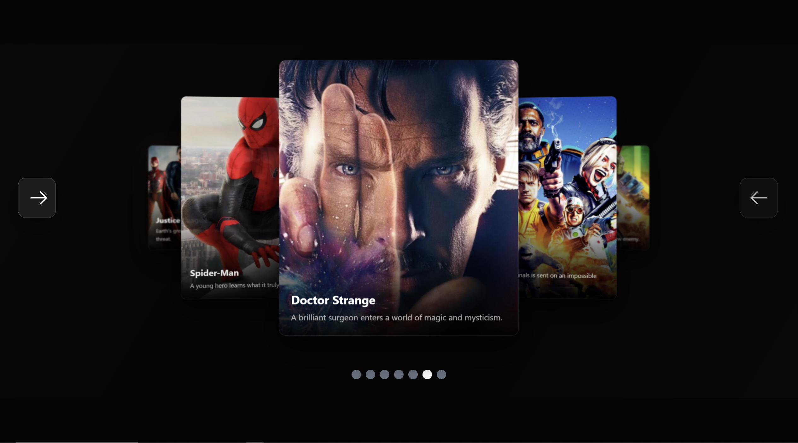

# 🎬 SliderPro

> A smooth, responsive and visually immersive **3D Movie Carousel** built with **Vanilla JavaScript** and **Tailwind CSS**.

<div align="center">

### 🚀 Interactive • Responsive • Smooth • No Frameworks

</div>

---

## ✨ Preview



---

## 🌐 Live Demo

🎥 **Try the project here:**

**SliderPro → https://poria-dev.github.io/SliderPro/src**

---

## 🚀 About The Project

**SliderPro** is a modern movie carousel with a visually layered layout and a strong focus on smooth interactions.

The center slide becomes the main focus while the surrounding cards create a depth effect, giving the slider a clean **3D carousel experience**.

The project was built from scratch using **Vanilla JavaScript** for the slider logic and **Tailwind CSS** for the interface and responsive layout.

No frameworks.
No unnecessary libraries.
Just **HTML, Tailwind CSS and JavaScript**. ⚡

---

## ✨ Features

* 🎬 Interactive movie carousel
* 🖼️ Dynamic active slide
* 🎯 Center-focused card layout
* ↔️ Previous & Next navigation
* 🔘 Custom pagination indicators
* 🧊 Layered / 3D visual effect
* ⚡ Smooth transitions
* 📱 Fully responsive design
* 💻 Desktop, Tablet & Mobile support
* 🎨 Modern dark cinematic UI
* 🧠 Built with Vanilla JavaScript
* 💨 Styled with Tailwind CSS

---

## 🛠️ Built With

<div align="center">

| Technology               | Usage                       |
| ------------------------ | --------------------------- |
| 🌐 **HTML5**             | Project structure           |
| 💨 **Tailwind CSS**      | Styling & Responsive Design |
| ⚡ **Vanilla JavaScript** | Slider logic & interactions |

</div>

---

## 🎮 How It Works

The slider dynamically manages the position and state of each movie card.

Each slide can have a different visual state:

```text
← Previous Slides | Side Slides | Active Slide | Side Slides | Next Slides →
```

The active card receives the highest visual priority while the surrounding cards are positioned around it to create a layered carousel effect.

Navigation buttons update the active slide and smoothly animate the cards into their new positions.

---

## 📱 Responsive Design

SliderPro is designed to adapt across different screen sizes.

### 💻 Desktop

A wide cinematic layout with multiple visible cards and a strong center-focused composition.

### 📱 Mobile

The layout automatically adjusts to smaller screens so the main content remains clear, usable and visually balanced.

---

## 📂 Project Structure

```text
SliderPro/
│
├── src/
│   ├── index.html
│   ├── app.js
│   └── ...
│
├── sliderme.png
│
└── README.md
```

> Make sure `sliderme.png` stays in the repository so the preview image can be displayed inside this README.

---

## ⚙️ Run Locally

Clone the repository:

```bash
git clone https://github.com/poria-dev/SliderPro.git
```

Then open the project folder and run it with your preferred development environment.

Because this project uses simple front-end technologies, it can also be opened directly in the browser.

---

## 🎯 Project Goals

This project was created as a practice and showcase for:

* Advanced slider positioning
* DOM manipulation
* Smooth JavaScript animations
* Responsive UI development
* Tailwind CSS layouts
* Interactive user interfaces
* Creating modern carousel experiences without frameworks

---

## 🔥 Why SliderPro?

Instead of relying on a heavy framework, this project focuses on understanding the actual logic behind an interactive slider.

The goal was to create something that feels visually polished while keeping the core implementation lightweight.

```text
Vanilla JavaScript
        +
Tailwind CSS
        +
Responsive Design
        =
🎬 SliderPro
```

---

## 👨‍💻 Developer

### Poria Rezaee

**Front-End Developer**

I enjoy building interactive and visually engaging web experiences using modern front-end technologies.

⭐ If you like this project, consider giving the repository a star!

---

<div align="center">

### 🎬 SliderPro

**Built with ❤️ using Vanilla JavaScript & Tailwind CSS**

© 2026 Poria Dev

</div>


:)
